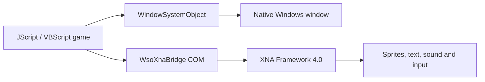

<div align="center">

# 🎮 WsoXnaBridge

### Build hardware-accelerated Windows games with JScript or VBScript

WsoXnaBridge connects **WindowSystemObject**, **Microsoft XNA Framework 4.0**, and the classic **Windows Script Host** in one small x86 COM component.

[](https://github.com/programci42/WsoXnaBridge)
[](https://github.com/programci42/WsoXnaBridge)
[](https://www.microsoft.com/download/details.aspx?id=20914)
[](LICENSE)
[](https://github.com/programci42/WsoXnaBridge/stargazers)

[Quick Start](#-quick-start) · [Example Game](#-example-game) · [Script API](#-script-api) · [Steam Developer Page](https://store.steampowered.com/curator/35460052)

</div>

---

## ✨ What it does

WSO gives scripts a native Windows window and control system. WsoXnaBridge adds the game layer: GPU-backed sprites, runtime text, sound, keyboard and mouse input, and a frame callback.

| Capability | Available |
|---|:---:|
| Hardware-accelerated 2D sprites | ✅ |
| Sprite sheets and source rectangles | ✅ |
| Runtime text with installed Windows fonts | ✅ |
| WAV sound effects and looping audio | ✅ |
| Keyboard and mouse input | ✅ |
| Per-frame JScript/VBScript callback | ✅ |
| One-click dependency installation | ✅ |
| Silent architecture-aware launcher | ✅ |



## 🚀 Quick start

1. Download this repository or choose **Code → Download ZIP**.
2. Extract the archive.
3. Double-click **`install.bat`** and approve the Windows administrator prompt.
4. Open **`Example_Game`** and double-click **`play.vbs`**.

The installer automatically:

- detects an existing 32-bit WSO installation;
- installs the bundled `wso.dll` when WSO is missing;
- silently installs XNA Framework 4.0 when required;
- copies and registers `WsoXnaBridge.dll`;
- runs a COM activation smoke test.

Use `uninstall.bat` as administrator to remove the bridge. XNA Framework and a pre-existing WSO installation are left in place.

## 🧟 Example game

The included highway game demonstrates the complete script workflow in both languages.

- scrolling LoopCut road and car artwork;
- animated zombies with four-frame walk cycles;
- collision scoring and two-piece dismemberment effects;
- looping engine audio and zombie-crush sound;
- live FPS counter;
- arrow-key driving;
- matching `example_game.js` and `example_game.vbs` implementations.

| Launch command | Result |
|---|---|
| Double-click `Example_Game\play.vbs` | Starts the JScript game without a console window |
| `Example_Game\play.vbs example_game.vbs` | Starts the VBScript game |
| `Example_Game\play.cmd` | Console launcher for troubleshooting |

If the bridge has not been installed, `play.vbs` starts the installer, waits for it to finish, and then launches the game.

## 🕹️ Start your own game

Copy `play.vbs` next to your game script and assets. It detects 32-bit or 64-bit Windows and always selects the correct x86 Windows Script Host.

```bat
play.vbs mygame.js
play.vbs mygame.vbs
```

WsoXnaBridge is an x86 COM component. A 64-bit `wscript.exe` cannot load it directly; the supplied launcher handles this automatically.

### Minimal JScript game

```js
var wso = new ActiveXObject("Scripting.WindowSystemObject");
var form = wso.CreateForm(100, 100, 820, 660);
var host = form.CreateActiveXControl(
    0, 0, 800, 600, "WsoXnaBridge.Renderer"
);
var game = host.Control;

var texture = game.LoadTexture("C:\\mygame\\player.png");
var player = game.CreateSprite(texture);
player.X = 400;
player.Y = 300;

function Update(dt) {
    if (game.IsKeyDown("Left"))  player.X -= 200 * dt;
    if (game.IsKeyDown("Right")) player.X += 200 * dt;
}

game.OnUpdate = Update;
form.Show();
wso.Run();
```

VBScript assigns the frame callback with:

```vb
Game.OnUpdate = GetRef("Update")
```

## 🧰 Script API

### Renderer

| Member | Purpose |
|---|---|
| `LoadTexture(path)` | Load a PNG/JPG texture at runtime |
| `CreateSprite(texture)` | Create a drawable sprite |
| `CreateText(text, font, size)` | Rasterize text into a sprite |
| `LoadSound(path)` | Load a WAV sound effect |
| `IsKeyDown(name)` | Read keyboard state |
| `IsMouseDown(button)` | Read mouse button state |
| `MouseX`, `MouseY` | Read cursor position |
| `ElapsedSeconds`, `TotalSeconds` | Read frame and total time |
| `BackgroundColor`, `Width`, `Height` | Configure or inspect the renderer |
| `OnUpdate` | Assign the per-frame callback |

### Sprite

- Transform: `X`, `Y`, `Rotation`, `ScaleX`, `ScaleY`, `OriginX`, `OriginY`
- Rendering: `Layer`, `Visible`, `Color`, `Alpha`, `Texture`
- Helpers: `Scale(value)`, `CenterOrigin()`, `Destroy()`
- Sprite sheets: `SetSourceRect(x, y, width, height)`, `ClearSourceRect()`
- Text sprites: `SetText(text)`

### Sound

- `Play()`
- `Play(volume)`
- `PlayLooped()`
- `StopLoop()`
- `DurationSeconds`

## 📁 Repository map

```text
WsoXnaBridge/
├─ Example_Game/             JScript and VBScript sample game
│  ├─ Assets/                Road, car, zombie and audio assets
│  ├─ example_game.js
│  ├─ example_game.vbs
│  └─ play.vbs
├─ Renderer.cs               XNA renderer and frame loop
├─ Sprite.cs                 Script-facing sprite object
├─ GameTexture.cs            Texture wrapper
├─ GameSound.cs              Sound wrapper
├─ TextRenderer.cs           GDI+ runtime text rasterizer
├─ WsoXnaBridge.dll          Ready-to-use x86 bridge
├─ install.bat               One-click setup
├─ uninstall.bat             Bridge removal
├─ play.vbs                  Silent game launcher
└─ test_*                    COM and rendering smoke tests
```

## 🛠️ Troubleshooting

| Symptom | Fix |
|---|---|
| `ActiveX object can't create object` | Run `install.bat`, approve UAC, then use `play.vbs` |
| `BadImageFormat` or wrong format | The 64-bit host was used; launch through `play.vbs` |
| XNA fails to load | Keep `XNA Framework 4.0 Redist.msi` beside `install.bat` and reinstall |
| Need detailed startup information | Read `renderer.log` beside the installed bridge DLL |
| Need visible launcher output | Use `play.cmd` instead of `play.vbs` |

## 👨‍💻 Developer

<div align="center">

### programci42

Independent Windows software and game developer.

[](https://github.com/programci42)
[](https://store.steampowered.com/curator/35460052)

**[Visit my Steam developer page →](https://store.steampowered.com/curator/35460052)**

</div>

## 📜 License and credits

WsoXnaBridge source code is available under the [MIT License](LICENSE).

Third-party runtime and audio attribution is documented in [THIRD_PARTY_NOTICES.md](THIRD_PARTY_NOTICES.md) and [Example_Game/AUDIO_CREDITS.md](Example_Game/AUDIO_CREDITS.md).

---

<div align="center">

If WsoXnaBridge helps your project, consider giving the repository a ⭐.

</div>
